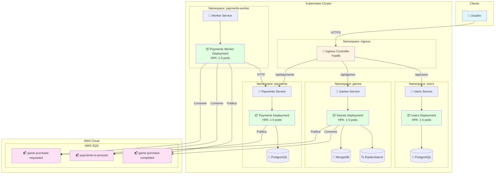

# Arquitetura do Sistema - FCG no Kubernetes

Este documento descreve a arquitetura completa do sistema FCG (Fiap Cloud Games) orquestrado no Kubernetes, incluindo todos os microsserviços, comunicação assíncrona e escalabilidade.

## Visão Geral

O sistema FCG é composto por 4 microsserviços principais, todos orquestrados no Kubernetes com auto-scaling horizontal (HPA) e comunicação assíncrona via AWS SQS.

## Diagrama de Arquitetura

## Componentes do Sistema

### 1. Microsserviço de Usuários (Users)

- **Namespace**: `users`
- **Imagem**: Docker otimizada com .NET 8 Alpine
- **Banco de Dados**: PostgreSQL
- **Escalabilidade**: HPA configurado (1-5 pods)
- **Métricas**: CPU 70%, Memory 80%
- **Monitoramento**: Prometheus
- **Endpoints**: `/api/users`

### 2. Microsserviço de Jogos (Games)

- **Namespace**: `games`
- **Imagem**: Docker otimizada com .NET 8 Alpine
- **Banco de Dados**: MongoDB (principal) + ElasticSearch (busca)
- **Escalabilidade**: HPA configurado (1-5 pods)
- **Métricas**: CPU 70%, Memory 80%
- **Monitoramento**: OpenTelemetry
- **Endpoints**: `/api/games`
- **Comunicação Assíncrona**:
  - Publica: `game-purchase-requested`
  - Consome: `game-purchase-completed`

### 3. Microsserviço de Pagamentos (Payments)

- **Namespace**: `payments`
- **Imagem**: Docker otimizada com .NET 8 Alpine
- **Banco de Dados**: PostgreSQL
- **Escalabilidade**: HPA configurado (1-5 pods)
- **Métricas**: CPU 70%, Memory 80%
- **Monitoramento**: OpenTelemetry + Application Insights + Grafana
- **Endpoints**: `/api/payments`
- **Comunicação Assíncrona**:
  - Publica: `payments-to-process`

### 4. Worker de Pagamentos (Payments Worker)

- **Namespace**: `payments-worker`
- **Imagem**: Docker otimizada com .NET 8
- **Tipo**: Background Worker (consumidor de filas)
- **Escalabilidade**: HPA configurado (1-5 pods)
- **Métricas**: CPU 70%, Memory 80%
- **Comunicação Assíncrona**:
  - Consome: `game-purchase-requested`
  - Consome: `payments-to-process`
  - Publica: `game-purchase-completed`

## Infraestrutura Kubernetes

### Namespaces

O sistema utiliza namespaces separados para isolamento:

- `users`: Microsserviço de usuários
- `games`: Microsserviço de jogos
- `payments`: Microsserviço de pagamentos
- `payments-worker`: Worker de processamento
- `ingress`: Ingress Controller (Traefik)

### Recursos Kubernetes

Cada microsserviço possui:

1. **Deployment**: Define os pods e containers
2. **Service**: Expõe os pods internamente
3. **HPA (HorizontalPodAutoscaler)**: Auto-scaling baseado em CPU/Memory
4. **ConfigMap**: Configurações não sensíveis
5. **Secret**: Credenciais e dados sensíveis
6. **Ingress**: Roteamento externo (Traefik)

### Auto-Scaling (HPA)

Todos os serviços possuem HPA configurado com:

- **Mínimo de réplicas**: 1
- **Máximo de réplicas**: 5
- **Métricas**:
  - CPU: 70% de utilização
  - Memory: 80% de utilização
- **Políticas de Scale Up**:
  - Percent: 100% a cada 30s
  - Pods: +2 pods a cada 30s
  - SelectPolicy: Max (escala mais rápido)
- **Políticas de Scale Down**:
  - Percent: 50% a cada 60s
  - Stabilization Window: 300s

## Comunicação Assíncrona

O sistema utiliza **AWS SQS** via **MassTransit** para comunicação assíncrona entre microsserviços.

### Filas SQS

1. **`game-purchase-requested`**
   - Publisher: Games Service
   - Consumer: Payments Worker
   - Propósito: Notificar que uma compra de jogo foi solicitada

2. **`payments-to-process`**
   - Publisher: Payments API
   - Consumer: Payments Worker
   - Propósito: Processar pagamentos criados

3. **`game-purchase-completed`**
   - Publisher: Payments Worker
   - Consumer: Games Service
   - Propósito: Notificar conclusão do pagamento

### Benefícios da Comunicação Assíncrona

- **Desacoplamento**: Microsserviços não dependem diretamente uns dos outros
- **Resiliência**: Mensagens são persistidas e processadas mesmo se um serviço estiver indisponível
- **Escalabilidade**: Workers podem escalar independentemente conforme a carga
- **Retry Automático**: MassTransit gerencia retry e dead-letter queues

## Fluxo de Dados

### Fluxo de Compra de Jogo

1. Usuário faz requisição POST `/api/games/purchase` via API Gateway
2. Games Service recebe a requisição e valida os dados
3. Games Service publica evento `GamePurchaseRequested` na fila `game-purchase-requested`
4. Payments Worker consome o evento e cria pagamento na Payments API
5. Payments API cria registro no banco e publica `PaymentRequestedMessage` na fila `payments-to-process`
6. Payments Worker consome a mensagem e processa o pagamento
7. Payments Worker publica `GamePurchaseCompleted` na fila `game-purchase-completed`
8. Games Service consome o evento e adiciona o jogo à biblioteca do usuário

## Monitoramento e Observabilidade

### AWS X-Ray (APM)

**Todos os microsserviços** estão configurados com AWS X-Ray para Application Performance Monitoring:

- **Games Service**: X-Ray habilitado para distributed tracing
- **Payments API**: X-Ray habilitado para rastreamento de requisições
- **Payments Worker**: X-Ray habilitado para rastreamento de processamento assíncrono
- **Users API**: X-Ray habilitado para rastreamento de autenticação e autorização

**Benefícios do X-Ray**:
- Distributed tracing através de todos os microsserviços
- Service map visual da arquitetura
- Identificação de gargalos e erros
- Análise de latência por endpoint
- Integração com CloudWatch para métricas

Para mais detalhes sobre configuração, consulte [xray-apm-setup.md](./xray-apm-setup.md).

### OpenTelemetry

- **Games Service**: Configurado com OpenTelemetry
- **Payments API**: Configurado com OpenTelemetry + Grafana

### Application Insights

- **Payments API**: Integração com Azure Application Insights

### Prometheus

- **Users API**: Métricas expostas em `/metrics`

### Health Checks

Todos os serviços expõem endpoints de health check:
- `/health`: Health check básico
- Utilizado pelo Kubernetes para liveness e readiness probes

## Segurança

### Docker Images

- Imagens base otimizadas (Alpine Linux)
- Usuários não-root nos containers
- Multi-stage builds para reduzir tamanho

### Kubernetes Secrets

- Credenciais armazenadas em Secrets
- ConfigMaps para configurações não sensíveis
- ImagePullSecrets para registries privados

## Deploy e CI/CD

O sistema utiliza GitHub Actions para CI/CD:

1. **CI**: Build, testes e validação
2. **CD**: Build da imagem Docker, push para ECR, deploy no EKS

Veja mais detalhes em [pipelines.md](./pipelines.md)

## Escalabilidade

O sistema foi projetado para escalar horizontalmente:

- **HPA**: Escala automaticamente baseado em métricas de CPU/Memory
- **Stateless Services**: Todos os serviços são stateless, permitindo múltiplas réplicas
- **Message Queues**: Filas SQS garantem que mensagens sejam processadas mesmo com alta carga
- **Load Balancing**: Kubernetes Service faz load balancing entre pods

## Resiliência

- **Health Checks**: Liveness e readiness probes garantem que apenas pods saudáveis recebam tráfego
- **Retry**: MassTransit gerencia retry automático de mensagens
- **Dead Letter Queues**: Mensagens que falham são enviadas para DLQ
- **Circuit Breaker**: Implementado via MassTransit

## Próximos Passos

- [ ] Implementar Service Mesh (Istio/Linkerd) para observabilidade avançada
- [ ] Adicionar monitoring centralizado (Prometheus + Grafana)
- [ ] Implementar distributed tracing completo
- [ ] Adicionar métricas customizadas para business KPIs
