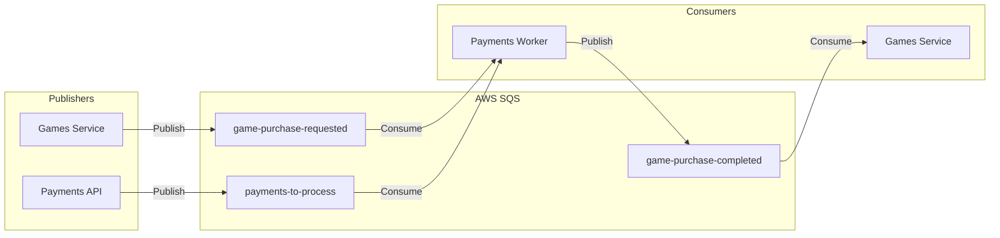
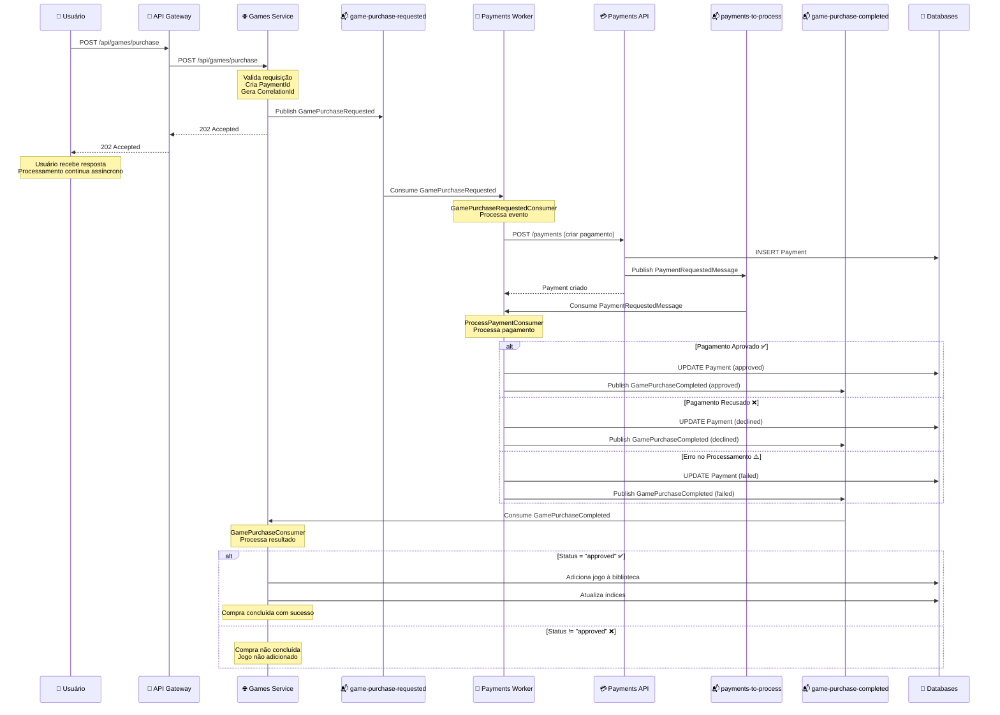

# Fluxo de Comunicação Assíncrona - FCG

Este documento descreve detalhadamente o fluxo de comunicação assíncrona entre os microsserviços do sistema FCG utilizando AWS SQS e MassTransit.

## Visão Geral

O sistema utiliza **AWS SQS** como message broker e **MassTransit** como framework de mensageria para garantir comunicação assíncrona, desacoplada e resiliente entre os microsserviços.

## Arquitetura de Mensageria



## Filas SQS

### 1. `game-purchase-requested`

**Propósito**: Notificar que uma compra de jogo foi solicitada pelo usuário.

**Publisher**: Games Service  
**Consumer**: Payments Worker

**Evento**: `GamePurchaseRequested`

```csharp
public record GamePurchaseRequested(
    Guid PaymentId,
    Guid UserId,
    string GameId,
    decimal Amount,
    string Currency,
    string PaymentMethod,
    Guid CorrelationId
);
```

**Fluxo**:
1. Usuário solicita compra via POST `/api/games/purchase`
2. Games Service valida a requisição
3. Games Service publica `GamePurchaseRequested` na fila
4. Retorna resposta imediata ao usuário (202 Accepted)

### 2. `payments-to-process`

**Propósito**: Processar pagamentos que foram criados na Payments API.

**Publisher**: Payments API  
**Consumer**: Payments Worker

**Mensagem**: `PaymentRequestedMessage`

```csharp
public record PaymentRequestedMessage(
    Guid PaymentId,
    Guid CorrelationId,
    Guid UserId,
    string GameId,
    decimal Amount,
    string Currency,
    string PaymentMethod,
    DateTime OccurredAt,
    string Version
);
```

**Fluxo**:
1. Payments API cria registro de pagamento no banco
2. Payments API publica `PaymentRequestedMessage` na fila
3. Worker processa o pagamento de forma assíncrona

### 3. `game-purchase-completed`

**Propósito**: Notificar que o processamento do pagamento foi concluído.

**Publisher**: Payments Worker  
**Consumer**: Games Service

**Evento**: `GamePurchaseCompleted`

```csharp
public record GamePurchaseCompleted(
    Guid PaymentId,
    Guid UserId,
    string GameId,
    decimal Amount,
    string Currency,
    string PaymentMethod,
    string Status, // "approved", "declined", "failed"
    string? Reason,
    Guid CorrelationId,
    DateTime CompletedAt
);
```

**Fluxo**:
1. Payments Worker processa o pagamento
2. Worker publica `GamePurchaseCompleted` com status
3. Games Service consome e atualiza a biblioteca do usuário

## Fluxo Completo: Compra de Jogo



## Detalhamento dos Consumers

### 1. GamePurchaseRequestedConsumer (Payments Worker)

**Fila**: `game-purchase-requested`

**Responsabilidades**:
- Recebe evento de compra solicitada
- Cria pagamento na Payments API
- Trata erros e publica falhas se necessário

**Código**:
```csharp
public class GamePurchaseRequestedConsumer : IConsumer<GamePurchaseRequestedEvent>
{
    public async Task Consume(ConsumeContext<GamePurchaseRequestedEvent> context)
    {
        var purchaseEvent = context.Message;
        
        // Cria pagamento na Payments API
        var success = await _paymentService.CreatePaymentAsync(purchaseEvent);
        
        if (!success)
        {
            // Publica falha se necessário
            throw new Exception("Falha ao criar pagamento");
        }
    }
}
```

### 2. ProcessPaymentConsumer (Payments Worker)

**Fila**: `payments-to-process`

**Responsabilidades**:
- Processa pagamento criado
- Simula chamada a gateway de pagamento
- Atualiza status do pagamento
- Publica resultado em `game-purchase-completed`

**Código**:
```csharp
public class ProcessPaymentConsumer : IConsumer<PaymentRequestedMessage>
{
    public async Task Consume(ConsumeContext<PaymentRequestedMessage> context)
    {
        var message = context.Message;
        
        // Processa pagamento
        var success = await _paymentService.ProcessPaymentAsync(message);
        
        // Status é publicado automaticamente pelo PaymentService
    }
}
```

### 3. GamePurchaseConsumer (Games Service)

**Fila**: `game-purchase-completed`

**Responsabilidades**:
- Recebe resultado do processamento de pagamento
- Se aprovado, adiciona jogo à biblioteca do usuário
- Atualiza índices no ElasticSearch

**Código**:
```csharp
public class GamePurchaseConsumer : IConsumer<GamePurchaseCompleted>
{
    public async Task Consume(ConsumeContext<GamePurchaseCompleted> context)
    {
        var completed = context.Message;
        
        if (completed.Status == "approved")
        {
            // Adiciona jogo à biblioteca
            await _libraryUseCase.AddGameToLibraryAsync(
                completed.UserId, 
                completed.GameId
            );
        }
    }
}
```

## Tratamento de Erros e Retry

### Retry Automático (MassTransit)

O MassTransit gerencia automaticamente retry de mensagens:

- **Retry Policy**: Configurado para tentar novamente em caso de falha
- **Exponential Backoff**: Intervalo entre retries aumenta exponencialmente
- **Max Retries**: Limite máximo de tentativas

### Dead Letter Queue (DLQ)

Mensagens que falham após todas as tentativas são enviadas para DLQ:

- **DLQ Pattern**: `{queue-name}-error`
- **Monitoramento**: DLQs devem ser monitoradas para identificar problemas
- **Recuperação**: Mensagens podem ser reprocessadas manualmente

### Idempotência

Todos os consumers são idempotentes:

- **PaymentId**: Identificador único garante que pagamentos não sejam processados duas vezes
- **CorrelationId**: Rastreia o fluxo completo da transação
- **Status Checks**: Verificam se operação já foi realizada antes de processar

## Configuração MassTransit

### Games Service

```csharp
services.AddMassTransit(x =>
{
    x.UsingAmazonSqs((context, cfg) =>
    {
        cfg.Host(region, h =>
        {
            h.AccessKey(accessKey);
            h.SecretKey(secretKey);
        });
        
        // Configura filas
        cfg.Message<GamePurchaseRequested>(m =>
            m.SetEntityName("game-purchase-requested"));
        
        cfg.Message<GamePurchaseCompleted>(m =>
            m.SetEntityName("game-purchase-completed"));
        
        // Consumer
        cfg.ReceiveEndpoint("game-purchase-completed", e =>
        {
            e.ConfigureConsumer<GamePurchaseConsumer>(context);
        });
    });
});
```

### Payments Worker

```csharp
services.AddMassTransit(x =>
{
    x.UsingAmazonSqs((context, cfg) =>
    {
        cfg.Host(region, h =>
        {
            h.AccessKey(accessKey);
            h.SecretKey(secretKey);
        });
        
        // Consumers
        x.AddConsumer<GamePurchaseRequestedConsumer>();
        x.AddConsumer<ProcessPaymentConsumer>();
        
        cfg.ReceiveEndpoint("game-purchase-requested", e =>
        {
            e.ConfigureConsumer<GamePurchaseRequestedConsumer>(context);
            e.PrefetchCount = 10;
        });
        
        cfg.ReceiveEndpoint("payments-to-process", e =>
        {
            e.ConfigureConsumer<ProcessPaymentConsumer>(context);
            e.PrefetchCount = 10;
        });
    });
});
```

## Observabilidade

### Correlation ID

Todos os eventos incluem `CorrelationId` para rastreamento:

- **Propagação**: CorrelationId é propagado através de todos os serviços
- **Logs**: Todos os logs incluem CorrelationId
- **Tracing**: OpenTelemetry utiliza CorrelationId para distributed tracing

### Logs Estruturados

Todos os eventos são logados com informações estruturadas:

```csharp
_logger.LogInformation(
    "Processando evento GamePurchaseRequested: " +
    "PaymentId={PaymentId}, " +
    "CorrelationId={CorrelationId}, " +
    "UserId={UserId}, " +
    "GameId={GameId}",
    purchaseEvent.PaymentId,
    purchaseEvent.CorrelationId,
    purchaseEvent.UserId,
    purchaseEvent.GameId
);
```

### Métricas

Métricas coletadas:

- **Mensagens Publicadas**: Por fila e tipo de evento
- **Mensagens Consumidas**: Por fila e consumer
- **Tempo de Processamento**: Latência de cada etapa
- **Taxa de Erro**: Erros por tipo e fila

## Benefícios da Arquitetura Assíncrona

### 1. Desacoplamento

- Microsserviços não dependem diretamente uns dos outros
- Mudanças em um serviço não afetam outros imediatamente
- Facilita evolução independente

### 2. Escalabilidade

- Workers podem escalar independentemente
- Alta carga em uma fila não afeta outros serviços
- HPA pode escalar baseado em métricas de fila

### 3. Resiliência

- Mensagens são persistidas
- Processamento continua mesmo se serviços estiverem indisponíveis
- Retry automático garante processamento eventual

### 4. Performance

- Resposta imediata ao usuário (202 Accepted)
- Processamento em background
- Melhor experiência do usuário

## Monitoramento e Alertas

### Métricas Importantes

1. **Tamanho das Filas**: Indica backlog de processamento
2. **Taxa de Consumo**: Mensagens processadas por segundo
3. **Taxa de Erro**: Percentual de mensagens que falham
4. **Latência**: Tempo entre publicação e consumo

### Alertas Recomendados

- **Fila Crescendo**: Tamanho da fila acima de threshold
- **Alta Taxa de Erro**: Mais de X% de mensagens falhando
- **DLQ com Mensagens**: Indica problemas que precisam atenção
- **Latência Alta**: Processamento mais lento que esperado

## Troubleshooting

### Mensagens não sendo processadas

1. Verificar se consumers estão rodando
2. Verificar conectividade com SQS
3. Verificar logs de erro
4. Verificar DLQ para mensagens com erro

### Mensagens duplicadas

1. Verificar idempotência dos consumers
2. Verificar configuração de visibility timeout
3. Verificar se há múltiplos consumers processando mesma mensagem

### Alta latência

1. Verificar métricas de CPU/Memory dos workers
2. Verificar se HPA está escalando adequadamente
3. Verificar tamanho das filas
4. Verificar latência do banco de dados
