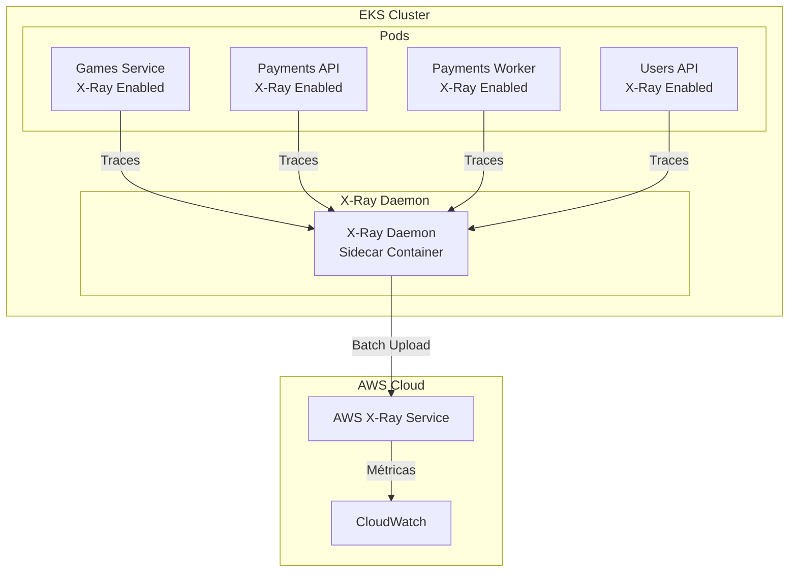

# Configuração AWS X-Ray APM

Este documento descreve como configurar AWS X-Ray para Application Performance Monitoring (APM) em todos os microsserviços do sistema FCG.

## Visão Geral

AWS X-Ray é um serviço que ajuda a analisar e depurar aplicações distribuídas em produção. Com X-Ray, você pode:

- **Rastrear requisições**: Ver como uma requisição se move através de todos os componentes da aplicação
- **Identificar gargalos**: Encontrar onde a aplicação está lenta ou com erros
- **Analisar performance**: Entender como a aplicação e suas dependências estão performando
- **Distributed Tracing**: Rastrear requisições através de múltiplos microsserviços

## Arquitetura X-Ray no Kubernetes



## Pré-requisitos

1. **Cluster EKS configurado** na AWS
2. **IAM Role** com permissões para X-Ray
3. **X-Ray Daemon** rodando no cluster (via DaemonSet ou sidecar)

## Passo 1: Configurar IAM Role para X-Ray

### Criar Policy para X-Ray

```json
{
  "Version": "2012-10-17",
  "Statement": [
    {
      "Effect": "Allow",
      "Action": [
        "xray:PutTraceSegments",
        "xray:PutTelemetryRecords",
        "xray:GetSamplingRules",
        "xray:GetSamplingTargets"
      ],
      "Resource": "*"
    }
  ]
}
```

### Anexar Policy ao IAM Role do Pod

Se você está usando **IRSA (IAM Roles for Service Accounts)**, anexe a policy ao role:

```bash
# Obter o role ARN do service account
kubectl get serviceaccount -n games games-sa -o jsonpath='{.metadata.annotations.eks\.amazonaws\.com/role-arn}'

# Anexar policy ao role (via AWS Console ou CLI)
aws iam attach-role-policy \
  --role-name <EKS_POD_ROLE_NAME> \
  --policy-arn arn:aws:iam::<ACCOUNT_ID>:policy/XRayWritePolicy
```

## Passo 2: Instalar X-Ray Daemon no Cluster

### Opção 1: DaemonSet (Recomendado)

Crie um DaemonSet para rodar o X-Ray daemon em cada nó:

```yaml
apiVersion: apps/v1
kind: DaemonSet
metadata:
  name: xray-daemon
  namespace: kube-system
spec:
  selector:
    matchLabels:
      app: xray-daemon
  template:
    metadata:
      labels:
        app: xray-daemon
    spec:
      serviceAccountName: xray-daemon
      containers:
      - name: xray-daemon
        image: amazon/aws-xray-daemon:latest
        ports:
        - containerPort: 2000
          protocol: UDP
        env:
        - name: AWS_REGION
          value: "us-east-1"
        resources:
          limits:
            cpu: 100m
            memory: 128Mi
          requests:
            cpu: 50m
            memory: 64Mi
```

### Opção 2: Sidecar Container (Alternativa)

Adicione o X-Ray daemon como sidecar em cada deployment:

```yaml
containers:
- name: xray-daemon
  image: amazon/aws-xray-daemon:latest
  ports:
  - containerPort: 2000
    protocol: UDP
  env:
  - name: AWS_REGION
    value: "us-east-1"
```

## Passo 3: Configurar Service Accounts com IRSA

Para cada namespace, crie um Service Account com anotação IRSA:

```yaml
apiVersion: v1
kind: ServiceAccount
metadata:
  name: games-sa
  namespace: games
  annotations:
    eks.amazonaws.com/role-arn: arn:aws:iam::<ACCOUNT_ID>:role/xray-role
```

Atualize os deployments para usar o service account:

```yaml
spec:
  template:
    spec:
      serviceAccountName: games-sa
```

## Passo 4: Configurar Variáveis de Ambiente

Adicione as seguintes variáveis de ambiente nos ConfigMaps:

### Games Service

```yaml
apiVersion: v1
kind: ConfigMap
metadata:
  name: games-config
  namespace: games
data:
  XRay__ServiceName: "fcg-games-service"
  XRay__TracingDisabled: "false"
  _X_AMZN_TRACE_ID: ""  # Será preenchido automaticamente
```

### Payments API

```yaml
apiVersion: v1
kind: ConfigMap
metadata:
  name: payments-config
  namespace: payments
data:
  XRay__ServiceName: "fcg-payments-api"
  XRay__TracingDisabled: "false"
```

### Payments Worker

```yaml
apiVersion: v1
kind: ConfigMap
metadata:
  name: payments-worker-config
  namespace: payments-worker
data:
  XRay__ServiceName: "fcg-payments-worker"
  XRay__TracingDisabled: "false"
```

### Users API

```yaml
apiVersion: v1
kind: ConfigMap
metadata:
  name: users-config
  namespace: users
data:
  XRay__ServiceName: "fcg-users-api"
  XRay__TracingDisabled: "false"
```

## Passo 5: Configurar X-Ray Daemon Endpoint

O X-Ray SDK automaticamente detecta o daemon em `127.0.0.1:2000` quando rodando como sidecar, ou você pode configurar explicitamente:

```yaml
env:
- name: AWS_XRAY_DAEMON_ADDRESS
  value: "xray-daemon.kube-system:2000"
```

## Passo 6: Verificar Configuração

### Verificar se X-Ray está funcionando

1. **Verificar logs do X-Ray Daemon**:
```bash
kubectl logs -n kube-system -l app=xray-daemon -f
```

2. **Verificar traces no console AWS**:
   - Acesse AWS Console → X-Ray → Traces
   - Procure por traces do serviço

3. **Verificar métricas no CloudWatch**:
   - Acesse CloudWatch → Metrics → AWS/X-Ray

## Configuração de Sampling

Para controlar a quantidade de traces coletados, configure sampling rules:

### Criar Sampling Rule via AWS Console

1. Acesse AWS X-Ray Console
2. Vá em **Sampling rules**
3. Crie uma nova regra:

```json
{
  "version": 2,
  "default": {
    "fixed_rate": 0.1,
    "reservoir_size": 1
  },
  "rules": [
    {
      "description": "Sample 100% of errors",
      "priority": 1,
      "fixed_rate": 1.0,
      "reservoir_size": 100,
      "service_name": "*",
      "service_type": "*",
      "host": "*",
      "http_method": "*",
      "url_path": "*",
      "resource_arn": "*",
      "attributes": {
        "http.status_code": {
          "400": true,
          "500": true
        }
      }
    },
    {
      "description": "Sample 10% of normal traffic",
      "priority": 2,
      "fixed_rate": 0.1,
      "reservoir_size": 1,
      "service_name": "*",
      "service_type": "*"
    }
  ]
}
```

### Configurar Sampling via Variável de Ambiente

```yaml
env:
- name: AWS_XRAY_TRACING_NAME
  value: "fcg-games-service"
- name: _X_AMZN_TRACE_ID
  value: ""  # Preenchido automaticamente pelo load balancer
```

## Visualizando Traces no X-Ray

### Service Map

O Service Map mostra a arquitetura da aplicação e como os serviços se comunicam:

1. Acesse AWS X-Ray Console
2. Vá em **Service map**
3. Visualize a arquitetura completa

### Trace Details

Para ver detalhes de uma requisição específica:

1. Acesse **Traces**
2. Filtre por serviço, tempo, ou erro
3. Clique em um trace para ver detalhes

### Análise

Use **Analytics** para:
- Identificar os serviços mais lentos
- Encontrar erros mais comuns
- Analisar latência por endpoint

## Integração com CloudWatch

X-Ray automaticamente envia métricas para CloudWatch:

- **Latência**: Tempo de resposta por serviço
- **Erros**: Taxa de erro por serviço
- **Falhas**: Requisições que falharam
- **Throttles**: Requisições limitadas

### Criar Dashboards no CloudWatch

```json
{
  "widgets": [
    {
      "type": "metric",
      "properties": {
        "metrics": [
          ["AWS/X-Ray", "Latency", "ServiceName", "fcg-games-service"],
          [".", "ErrorRate", ".", "."],
          [".", "FaultRate", ".", "."]
        ],
        "period": 300,
        "stat": "Average",
        "region": "us-east-1",
        "title": "FCG Games Service - X-Ray Metrics"
      }
    }
  ]
}
```

## Troubleshooting

### Traces não aparecem no X-Ray

1. **Verificar IAM Permissions**:
```bash
aws iam get-role-policy --role-name <ROLE_NAME> --policy-name XRayWritePolicy
```

2. **Verificar X-Ray Daemon**:
```bash
kubectl get pods -n kube-system -l app=xray-daemon
kubectl logs -n kube-system -l app=xray-daemon
```

3. **Verificar variáveis de ambiente**:
```bash
kubectl exec -n games <POD_NAME> -- env | grep XRAY
```

4. **Verificar logs da aplicação**:
```bash
kubectl logs -n games <POD_NAME> | grep -i xray
```

### Erro: "Unable to send segments to X-Ray daemon"

- Verifique se o daemon está rodando
- Verifique conectividade de rede entre pod e daemon
- Verifique se a porta 2000/UDP está acessível

### Erro: "Access Denied"

- Verifique IAM permissions
- Verifique se o Service Account tem a role correta
- Verifique se a role tem trust relationship com o cluster

## Custos

AWS X-Ray tem os seguintes custos (região us-east-1):

- **Primeiros 100,000 traces/mês**: Grátis
- **Traces adicionais**: $5.00 por 1,000,000 traces
- **Storage**: $0.50 por GB/mês após os primeiros 100 GB

**Dica**: Use sampling para reduzir custos mantendo visibilidade de erros.

## Melhores Práticas

1. **Use Sampling**: Configure sampling rules para reduzir custos
2. **Filtre Health Checks**: Não trace health checks para reduzir ruído
3. **Monitore Custos**: Configure alertas no CloudWatch para custos de X-Ray
4. **Use Service Maps**: Visualize a arquitetura regularmente
5. **Configure Alertas**: Crie alertas para alta latência ou taxa de erro

## Referências

- [AWS X-Ray Documentation](https://docs.aws.amazon.com/xray/)
- [X-Ray SDK for .NET](https://docs.aws.amazon.com/xray/latest/devguide/xray-sdk-dotnet.html)
- [X-Ray no Kubernetes](https://docs.aws.amazon.com/xray/latest/devguide/xray-daemon.html)
- [IRSA Setup](https://docs.aws.amazon.com/eks/latest/userguide/iam-roles-for-service-accounts.html)
